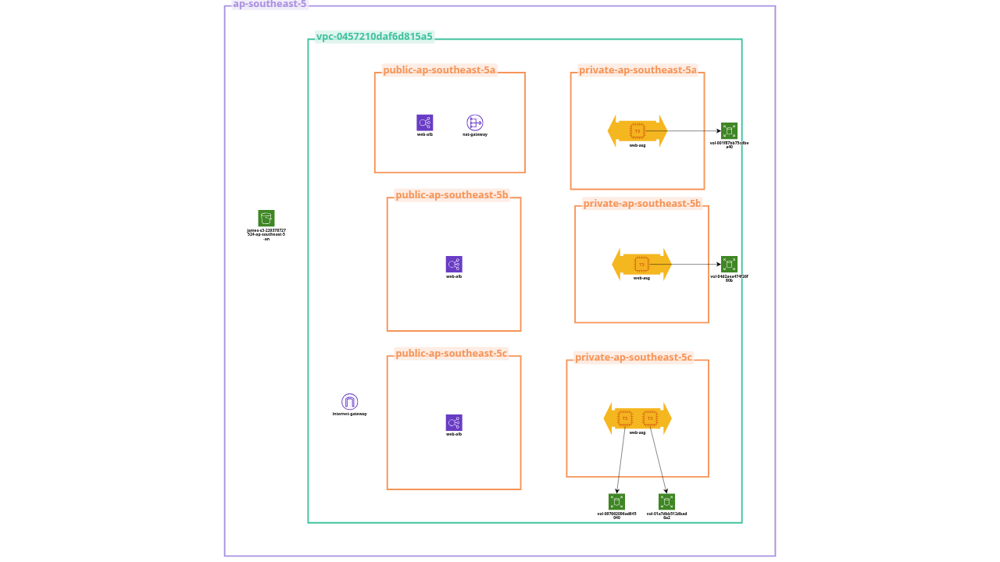

# AWS Scalable Web Infrastructure with Terraform

This project implements a highly available and scalable web server architecture on AWS using Terraform. It features a modular design that facilitates easy management and scalability of the underlying infrastructure.

## Project Overview

The architecture transitions from a single-node web server to a robust, load-balanced environment:
- **High Availability:** Resources are distributed across multiple Availability Zones.
- **Security:** Web servers are isolated in private subnets, accessible only through a public Application Load Balancer.
- **Scalability:** An Auto Scaling Group (ASG) manages instance lifecycle and capacity based on demand.
- **Automation:** User data scripts handle the automatic deployment of web content from an S3 bucket.

## Architecture Diagram


## File Structure

The project is organized into reusable modules:

```text
.
├── main.tf                 # Root module configuration
├── variables.tf            # Global variables
├── README.md               # Project documentation
└── modules/
   ├── vpc_module/         # VPC, Subnets, and Networking
   ├── sg_module/          # Security Groups 
   ├── alb_module/         # Application Load Balancer & Target Groups
   ├── asg_module/         # Auto Scaling Group & Launch Template
   └── ec2_module/         # Legacy Standalone EC2 module 
```

## Prerequisites

- [Terraform](https://www.terraform.io/downloads.html) installed.
- AWS CLI configured with appropriate credentials.
- An S3 bucket containing the website assets (portfolio HTML files).

---

## Infrastructure Update Log

## Phase 1: Initial Architecture (Single Node Web Server)
*This phase represents the infrastructure state prior to implementing load balancing and auto-scaling. The application was active, but running on a single public endpoint.*

**Networking & Security**
* **VPC Setup:** Deployed a foundational Virtual Private Cloud (VPC) with a `10.0.0.0/16` CIDR block routing across multiple Availability Zones.
* **Subnets:** Segmented the network into Public and Private subnets.
* **Security Groups:** 
  * `public-sg` created to allow inbound HTTP (Port 80) and SSH/SSM traversal (Port 22). 
  * `private-sg` created to restrict inbound HTTP access solely to resources originating from the `public-sg`.

**Compute & Application**
* **Standalone Web Server:** Provisioned a single EC2 instance (`t3.micro`) directly internet-facing inside the public subnet.
* **AMI Filtering:** Implemented Terraform data sources to dynamically fetch the latest `Amazon Linux 2023` AMI.
* **Bootstrapping (User Data):** Automated the web server setup via a Bash script to:
  * Install and enable the Apache (`httpd`) daemon.
  * Sync portfolio website assets directly from a private AWS S3 bucket (`s3://james-s3-229378727524-ap-southeast-5-an`).
  * Assign proper Apache system ownership to the HTML directories.

---

## Phase 2: High Availability Architecture (ALB + ASG) *[LATEST]*
*This phase represents the migration from a single point of failure to a highly available, load-balanced, and horizontally scalable architecture securely hidden behind private subnets.*

**Networking Migration**
* **Private Network Isolation:** The foundational architecture was shifted. Web servers were completely removed from the Public Subnets and migrated into the Private Subnets. Direct internet access to the EC2 instances has been restricted.

**Application Load Balancer (ALB)**
* Introduced a public-facing Application Load Balancer (`web-alb`) deployed across the public subnets to ingest raw internet traffic.
* Attached an HTTP listener pointing to a newly created Target Group (`web-tg`), which automatically performs rolling health checks on instances over port 80.

**Auto Scaling Group (ASG)**
* **Standalone EC2 Deprecation:** Removed the standalone `web_server` EC2 module entirely.
* **Launch Template (`web-lt`):** Created a scalable template containing the base configurations, mirroring the original standalone EC2 including instance type, AMI, and the website-building user data script.
* **IAM Instance Profiles:** Attached an IAM profile (`WebServerS3Access`) directly into the Launch Template to seamlessly grant the automated instances secure permissions to pull website files from S3 and interact with AWS SSM (Removing the need for traditional SSH keys).
* **Scaling Triggers:** Automated the Auto Scaling Group behavior to maintain a desired capacity of `1` instance, explicitly capping scaling behaviors internally to a maximum of `2` dynamic instances.
* **Target Group Registration:** Bound the ASG to the ALB Target Group to execute automated traffic shifting immediately upon a new node's deployment.

**Terraform State & Refactoring**
* **Tagging Inheritance:** Enforced strict, centralized tagging across the entire infrastructure footprint by declaring `default_tags` at the `main.tf` Provider level (`Terraform = "true"` , `Project = "Lab"`).
* **Naming Standardization:** Stripped out legacy underscore variables and adopted strict AWS-compliant hyphenated naming conventions (e.g. `web_tg` → `web-tg`).
* **State Outputs:** Added automated `output.tf` state references allowing immediate tracking of the ASG Name, internal ARN, and Launch Template ID from the backend.
